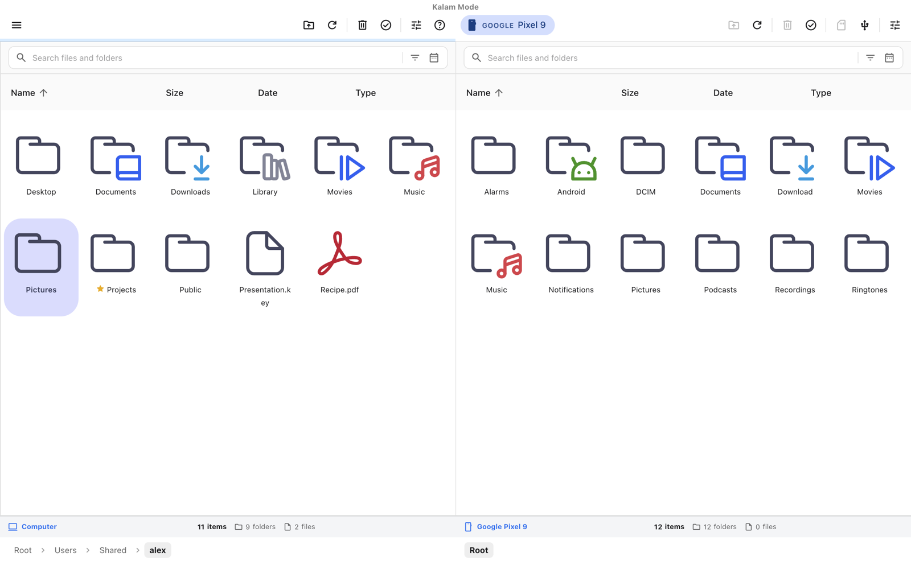
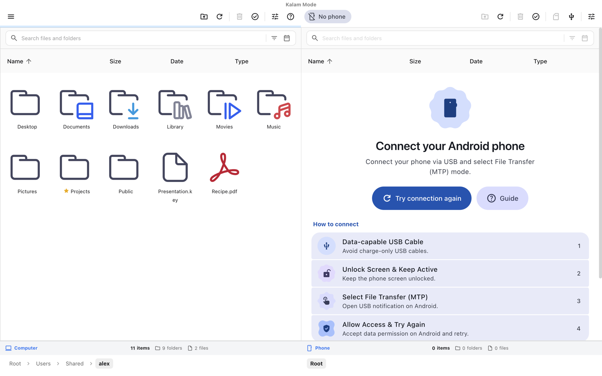
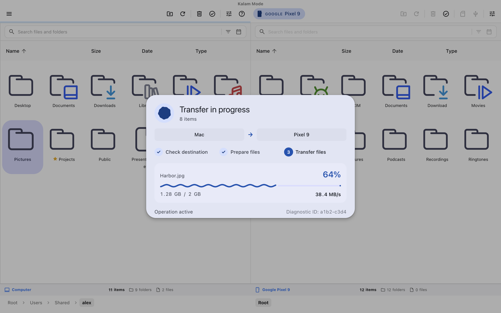
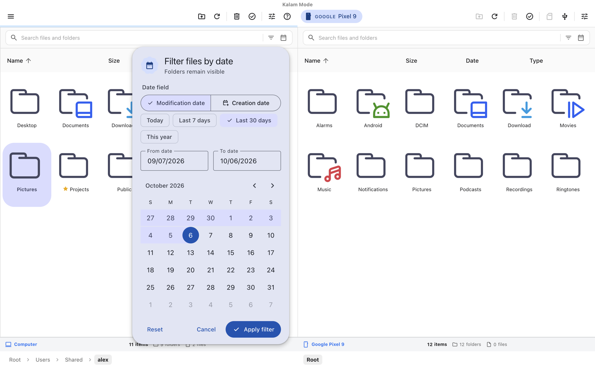
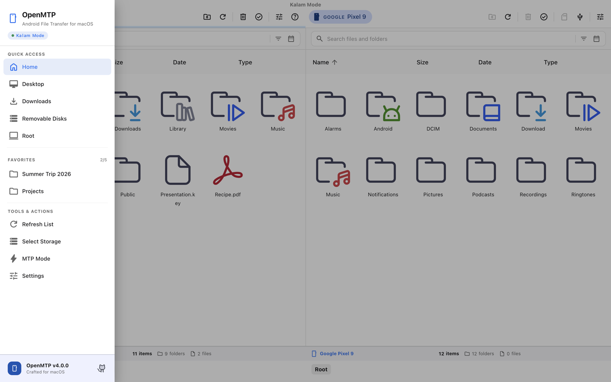
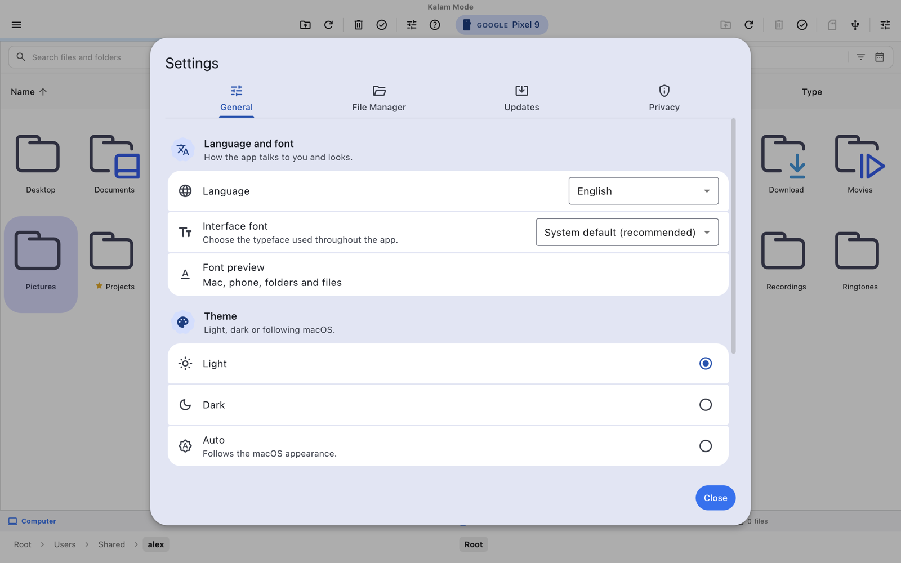
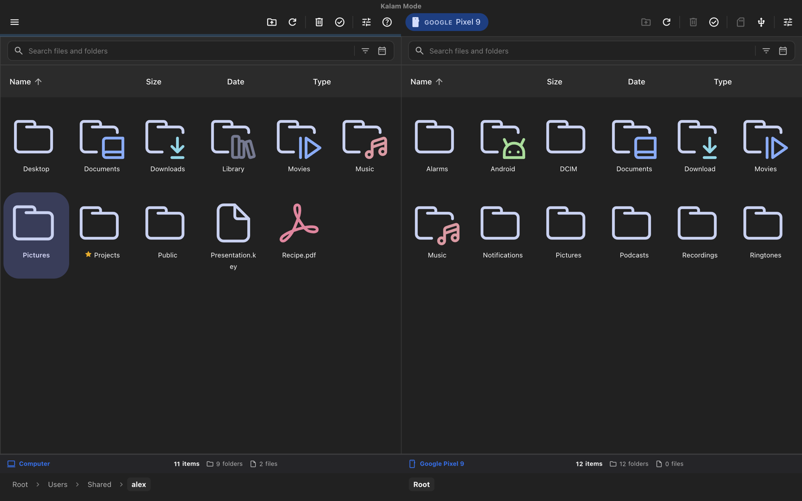

<p align="center">
  
</p>

<h1 align="center">OpenMTP Refined</h1>

<p align="center"><b>Transfer files between your Mac and your Android phone over USB — redesigned with Material 3 Expressive.</b></p>

[](https://github.com/phantumblade/OpenMTP-Refined/releases/latest)
[](https://github.com/phantumblade/OpenMTP-Refined/releases/latest)
[](LICENSE)

🇬🇧 English · [🇮🇹 Italiano](#-italiano)

OpenMTP Refined is an independent fork of [OpenMTP](https://github.com/ganeshrvel/openmtp),
the open-source Android file manager for macOS. It keeps the proven MTP engine
and rebuilds everything around it: a new Material 3 Expressive interface, a much
more reliable phone connection and clear explanations whenever something goes
wrong.

<p align="center">
  <a href="https://github.com/phantumblade/OpenMTP-Refined/releases/latest">
    
  </a>
</p>



| Connect your phone                                                                 | Transfer progress                                                                   |
| ---------------------------------------------------------------------------------- | ----------------------------------------------------------------------------------- |
|  |  |

| Filter by date                                           | Favorites and quick access                                       |
| -------------------------------------------------------- | ---------------------------------------------------------------- |
|  |  |

| Settings                                            | Dark theme                                           |
| --------------------------------------------------- | ---------------------------------------------------- |
|  |  |

> Screenshots use a demo account and demo file names.

## What's new in 4.0

- **Material 3 Expressive design** — Google's color system with light and dark
  themes, Material Symbols icons, expressive shapes, the morphing loading
  indicator and the wavy progress bar.
- **A connection that just works** — OpenMTP now frees the phone from the macOS
  services that grab it (Image Capture, Photos), avoids overlapping connection
  attempts and stops the endless "loading" loops of earlier versions.
- **Errors you can understand** — every connection problem (phone locked, file
  transfer not enabled, cable, another app using the phone, no storage) is
  explained in plain words, with what to do next.
- **Favorites** — star up to 5 folders and reach them from the sidebar.
- **Filters** — filter by date (modified or created, with quick ranges and the
  date format of your language) and by file type.
- **Smarter transfers** — clear phases (check, prepare, transfer), live speed,
  current file and a smooth progress bar.
- **Italian and English**, with a choice of interface font.

See the full list in the [CHANGELOG](CHANGELOG.md).

## Download and install

**Requirements:** a Mac with Apple Silicon (M1 or newer). Developed and tested
on macOS 26 Tahoe.

1. Download **`OpenMTP-Refined-4.0.0-arm64.dmg`** from the
   [latest release](https://github.com/phantumblade/OpenMTP-Refined/releases/latest).
2. Open the DMG and drag **OpenMTP** into **Applications**.
3. Open OpenMTP from Applications. The first time, macOS shows a warning,
   because the app is not notarized by Apple (that requires a paid developer
   account). Click **Done**.
4. Open **System Settings → Privacy & Security**, scroll down and click
   **Open Anyway** next to the OpenMTP message, then confirm with your password.

You only need to do this once. If macOS ever says the app "is damaged", run
this in Terminal and open it again:

```bash
xattr -dr com.apple.quarantine /Applications/OpenMTP.app
```

## Connect your phone

1. Use a **data** USB cable (many charging cables carry power only).
2. **Unlock** the phone and keep the screen on.
3. Pull down the notification shade, tap the **USB** notification and choose
   **File transfer**.
4. If the phone asks to **allow access to phone data**, tap **Allow**.
5. Close Android File Transfer, Image Capture or Photos if they are open, then
   click **Try connection again** in OpenMTP.

## Troubleshooting

| Message                          | What to do                                                                                         |
| -------------------------------- | -------------------------------------------------------------------------------------------------- |
| _The Mac does not see the phone_ | Try another data cable or USB port, and choose **File transfer** on the phone.                     |
| _No phone in File Transfer mode_ | Tap the USB notification on the phone and choose **File transfer**.                                |
| _The phone is locked_            | Unlock the phone, tap **Allow** if asked, and keep it unlocked until the files appear.             |
| _Another app is using the phone_ | Quit Android File Transfer, Image Capture, Photos or Smart Switch, then retry.                     |
| _The phone did not respond_      | Unplug the cable, unlock the phone, plug it back in and retry.                                     |
| Still not working                | In **Settings → General → Phone connection**, switch between **Kalam** and **Legacy**, then retry. |

The **Guide** button on the connection screen opens more detailed help.

## For developers

Requirements: Node.js 16+, Yarn 1.22, Xcode Command Line Tools and Go (only to
rebuild the native Kalam module).

```bash
yarn install --frozen-lockfile
```

```bash
yarn dev
```

`yarn test` runs the JavaScript lint, the performance and behaviour checks and
the Go tests. `yarn package-mac-local` builds an ad-hoc signed app, installs it
in `/Applications` and writes the DMG to `dist/`.

```text
app/components/m3/         Material 3 Expressive components
app/containers/HomePage/   File explorer, connection screen and transfers
app/helpers/               Connection, errors, favorites, dates, search
app/styles/m3/             Generated color scheme and design tokens
ffi/kalam/                 Native MTP engine (Go) and its bridge
scripts/                   Build, color generation and verification scripts
```

---

## 🇮🇹 Italiano

**Trasferisci file tra Mac e telefono Android via USB, con un'interfaccia
completamente ridisegnata in Material 3 Expressive.**

OpenMTP Refined è un fork indipendente di
[OpenMTP](https://github.com/ganeshrvel/openmtp). Mantiene il motore MTP
originale e rinnova tutto il resto: nuova interfaccia Material 3 Expressive,
connessione al telefono molto più affidabile e spiegazioni chiare quando
qualcosa non va.

### Novità della 4.0

- **Design Material 3 Expressive**: sistema colori Google con tema chiaro e
  scuro, icone Material Symbols, forme espressive, indicatore di caricamento
  animato e barra di avanzamento ondulata.
- **Connessione affidabile**: OpenMTP libera il telefono dai servizi di macOS
  che lo occupano (Acquisizione Immagine, Foto), evita tentativi sovrapposti e
  non resta più bloccato in caricamento infinito.
- **Errori comprensibili**: ogni problema (telefono bloccato, trasferimento file
  non attivo, cavo, telefono usato da un'altra app, memoria non disponibile) è
  spiegato con parole semplici, insieme a cosa fare.
- **Preferiti**: aggiungi fino a 5 cartelle con la stella e aprile dalla barra
  laterale.
- **Filtri**: per data (modifica o creazione, intervalli rapidi, formato
  gg/mm/aaaa) e per tipo di file.
- **Trasferimenti più chiari**: fasi visibili (controllo, preparazione,
  trasferimento), velocità, file corrente e avanzamento fluido.
- **Italiano e inglese**, con scelta del carattere dell'interfaccia.

### Scaricare e installare

**Requisiti:** Mac con Apple Silicon (M1 o successivo). Sviluppata e provata su
macOS 26 Tahoe.

1. Scarica **`OpenMTP-Refined-4.0.0-arm64.dmg`** dall'
   [ultima release](https://github.com/phantumblade/OpenMTP-Refined/releases/latest).
2. Apri il DMG e trascina **OpenMTP** nella cartella **Applicazioni**.
3. Apri OpenMTP da Applicazioni. La prima volta macOS mostra un avviso, perché
   l'app non è notarizzata da Apple (serve un account sviluppatore a
   pagamento). Fai clic su **Fine**.
4. Apri **Impostazioni di Sistema → Privacy e sicurezza**, scorri in basso e fai
   clic su **Apri comunque** accanto al messaggio di OpenMTP, poi conferma con
   la password.

Serve farlo una sola volta. Se macOS dice che l'app "è danneggiata", esegui nel
Terminale il comando qui sotto e riaprila:

```bash
xattr -dr com.apple.quarantine /Applications/OpenMTP.app
```

### Collegare il telefono

1. Usa un cavo USB **dati** (molti cavi di ricarica portano solo corrente).
2. **Sblocca** il telefono e tieni lo schermo acceso.
3. Apri la tendina delle notifiche, tocca la notifica **USB** e scegli
   **Trasferimento file**.
4. Se il telefono chiede di **consentire l'accesso ai dati**, tocca **Consenti**.
5. Chiudi Android File Transfer, Acquisizione Immagine o Foto se sono aperti,
   poi fai clic su **Riprova la connessione** in OpenMTP.

### Problemi frequenti

| Messaggio                                        | Cosa fare                                                                                                         |
| ------------------------------------------------ | ----------------------------------------------------------------------------------------------------------------- |
| _Il Mac non vede il telefono_                    | Prova un altro cavo dati o porta USB e scegli **Trasferimento file** sul telefono.                                |
| _Nessun telefono in modalità Trasferimento file_ | Tocca la notifica USB sul telefono e scegli **Trasferimento file**.                                               |
| _Il telefono è bloccato_                         | Sblocca il telefono, tocca **Consenti** se richiesto e tienilo sbloccato finché compaiono i file.                 |
| _Un’altra app sta usando il telefono_            | Chiudi Android File Transfer, Acquisizione Immagine, Foto o Smart Switch e riprova.                               |
| _Il telefono non ha risposto_                    | Scollega il cavo, sblocca il telefono, ricollegalo e riprova.                                                     |
| Continua a non funzionare                        | In **Impostazioni → Generali → Connessione al telefono** passa da **Kalam** a **Legacy** (o viceversa) e riprova. |

Il pulsante **Guida** nella schermata di connessione apre un aiuto più
dettagliato.

---

## Credits and license

OpenMTP was created by [Ganesh Rathinavel](https://github.com/ganeshrvel) and is
released under the MIT license. OpenMTP Refined, by
[Andrea Perini](https://github.com/phantumblade), keeps the original history and
copyright and is released under the same license.

- [LICENSE](LICENSE) · [NOTICE.md](NOTICE.md) · [CHANGELOG.md](CHANGELOG.md)
- Third-party assets (Material Symbols, Catppuccin icons, Phosphor, Lucide,
  shape-morph, Faculty Glyphic): see [THIRD_PARTY_NOTICES](THIRD_PARTY_NOTICES)
- Security reports: [SECURITY.md](SECURITY.md)

OpenMTP Refined is not affiliated with Google, Samsung or Apple.
